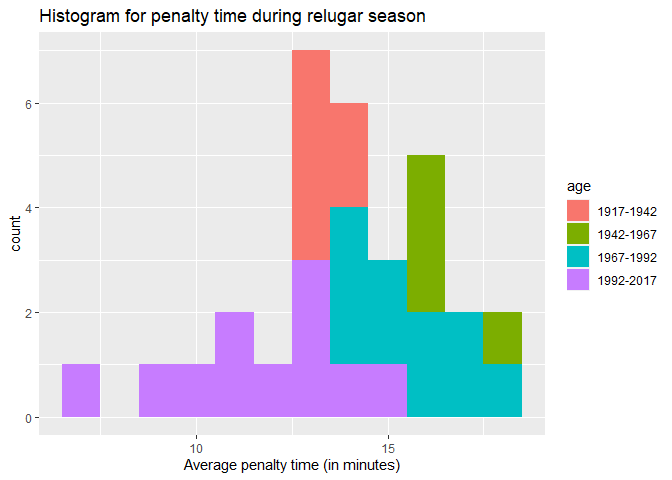
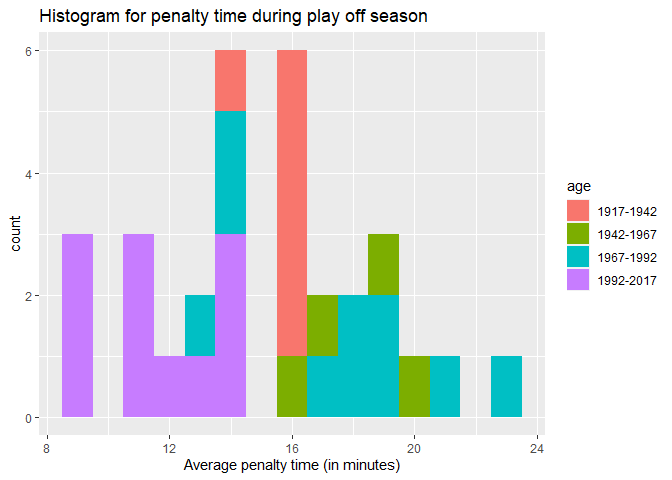

NHL data analysis
================
Mu-Tien, Lee
2020,09.04

  - [Discription](#discription)
  - [Data cleaning](#data-cleaning)
      - [Building functions to reach
        statsAPI](#building-functions-to-reach-statsapi)
      - [Building functions to reach
        recordAPI](#building-functions-to-reach-recordapi)
      - [Accessory for API endpoint](#accessory-for-api-endpoint)
  - [Data analysis](#data-analysis)
      - [Numeric summarize](#numeric-summarize)
          - [A contingency table (Division\*Fist year of play)  
            ](#a-contingency-table-divisionfist-year-of-play)
          - [Numeric summary table](#numeric-summary-table)
      - [Plots](#plots)
          - [A bar plot tells conference and
            division](#a-bar-plot-tells-conference-and-division)
          - [Histogram of penalty times](#histogram-of-penalty-times)
  - [Data analysis between 4 selected
    team](#data-analysis-between-4-selected-team)
      - [Numerical summary](#numerical-summary)
          - [Some data to compare between these
            team](#some-data-to-compare-between-these-team)
          - [Distribution of skater position for each
            team](#distribution-of-skater-position-for-each-team)
      - [Plots](#plots-1)
          - [Scatter and boxplot](#scatter-and-boxplot)

# Discription

This project is going to talk about some data in NHL the franchise are
loaded from
<https://gitlab.com/dword4/nhlapi/-/blob/master/records-api.md> and
<https://gitlab.com/dword4/nhlapi/-/blob/master/stats-api.md>. You may
use `endpoint` function and key in with correct endpoint’s name to get
whatever table you would like to get. At some point you can assign a
specific team by both name and team ID/franchise ID. After that I will
show you some data analysis among all active team and some selected
team. wish you can have some fun in this project\!

# Data cleaning

## Building functions to reach statsAPI

``` r
#build up base dataset for switch team.names and team.ID
text <- content(GET("https://statsapi.web.nhl.com/api/v1/teams?expand=team.roster"),"text")
base <- fromJSON(text, flatten = TRUE) 
base <- as.data.frame(base) %>% select(teams.franchise.teamName,teams.franchiseId,teams.teamName,teams.id)

#make a function to let user reach statsAPI
statsAPI <- function(x,teamID=NULL,season=NULL, ...){
  
#setting up base url for stats API
base_url <-"https://statsapi.web.nhl.com/api/v1/teams"
modifiers <- x

#construct the full path
if (x %in% "teamId"){
  full_url <- paste0(base_url, "?", modifiers, "=", teamID)
}
#convert team name into teamID
else if(is.character(teamID)){
  base <- base %>% filter(teams.teamName==teamID)
  teamID <- base[4]
}

if (x %in% c("expand=team.roster","expand=person.names","expand=team.schedule.next","expand=team.schedule.previous","expand=team.stats","stats=statsSingleSeasonPlayoffs")){
  
  if (is.null(teamID)){
    full_url <- paste0(base_url, "?", modifiers)}
  
  else {
    full_url <- paste0(base_url, "/", teamID, "?", modifiers)}
}  
  
else if (x %in% "expand=team.roster&season" ){
  if (is.null(season)){
    stop("seaon is missing")}
  
  else if(length(teamID)>1){
    stop("sorry, we can only show one team each time")}
  
  else if(is.null(teamID)){
    full_url <- paste0(base_url,"?", modifiers,"=", 20142015)}

  else {
    full_url <- paste0(base_url, "/", teamID, "?", modifiers,"=", season)}
}

# retrieve information in raw form
GET(full_url)
#transfer into JSON text form
text <- content(GET(full_url),"text")
#convert it to a list
mydata <- fromJSON(text, flatten = TRUE) 
mydata<- as.data.frame(mydata)
return(mydata)
}
```

## Building functions to reach recordAPI

Below is a function that can help you read whatever the endpoint you
would like to get, please key in the following option in the function.
NOTE: If you want to reach out to the **teamId** please put your teamID
as character, ex:`"2,12,22"` to reach the table.

``` r
endpoints <- c("franchise","franchise-team-totals","franchise-season-records","franchise-goalie-records","franchise-skater-records","expand=team.roster","expand=person.names","expand=team.schedule.next","expand=team.schedule.previous","expand=team.stats","expand=team.roster&season","teamId","stats=statsSingleSeasonPlayoffs")

idOption <- c(rep("None",2),rep("franchiseID or teamName without location",3),rep("teamID or teamName without location",8))

seasonOption <- c(rep("No",10),"Yes", "No","No")

kable(cbind(endpoints,idOption,seasonOption), format = "html") 
```

<table>

<thead>

<tr>

<th style="text-align:left;">

endpoints

</th>

<th style="text-align:left;">

idOption

</th>

<th style="text-align:left;">

seasonOption

</th>

</tr>

</thead>

<tbody>

<tr>

<td style="text-align:left;">

franchise

</td>

<td style="text-align:left;">

None

</td>

<td style="text-align:left;">

No

</td>

</tr>

<tr>

<td style="text-align:left;">

franchise-team-totals

</td>

<td style="text-align:left;">

None

</td>

<td style="text-align:left;">

No

</td>

</tr>

<tr>

<td style="text-align:left;">

franchise-season-records

</td>

<td style="text-align:left;">

franchiseID or teamName without location

</td>

<td style="text-align:left;">

No

</td>

</tr>

<tr>

<td style="text-align:left;">

franchise-goalie-records

</td>

<td style="text-align:left;">

franchiseID or teamName without location

</td>

<td style="text-align:left;">

No

</td>

</tr>

<tr>

<td style="text-align:left;">

franchise-skater-records

</td>

<td style="text-align:left;">

franchiseID or teamName without location

</td>

<td style="text-align:left;">

No

</td>

</tr>

<tr>

<td style="text-align:left;">

expand=team.roster

</td>

<td style="text-align:left;">

teamID or teamName without location

</td>

<td style="text-align:left;">

No

</td>

</tr>

<tr>

<td style="text-align:left;">

expand=person.names

</td>

<td style="text-align:left;">

teamID or teamName without location

</td>

<td style="text-align:left;">

No

</td>

</tr>

<tr>

<td style="text-align:left;">

expand=team.schedule.next

</td>

<td style="text-align:left;">

teamID or teamName without location

</td>

<td style="text-align:left;">

No

</td>

</tr>

<tr>

<td style="text-align:left;">

expand=team.schedule.previous

</td>

<td style="text-align:left;">

teamID or teamName without location

</td>

<td style="text-align:left;">

No

</td>

</tr>

<tr>

<td style="text-align:left;">

expand=team.stats

</td>

<td style="text-align:left;">

teamID or teamName without location

</td>

<td style="text-align:left;">

No

</td>

</tr>

<tr>

<td style="text-align:left;">

expand=team.roster\&season

</td>

<td style="text-align:left;">

teamID or teamName without location

</td>

<td style="text-align:left;">

Yes

</td>

</tr>

<tr>

<td style="text-align:left;">

teamId

</td>

<td style="text-align:left;">

teamID or teamName without location

</td>

<td style="text-align:left;">

No

</td>

</tr>

<tr>

<td style="text-align:left;">

stats=statsSingleSeasonPlayoffs

</td>

<td style="text-align:left;">

teamID or teamName without location

</td>

<td style="text-align:left;">

No

</td>

</tr>

</tbody>

</table>

``` r
kable(base, caption = "ID table for teams", format = "html") 
```

<table>

<caption>

ID table for teams

</caption>

<thead>

<tr>

<th style="text-align:left;">

teams.franchise.teamName

</th>

<th style="text-align:right;">

teams.franchiseId

</th>

<th style="text-align:left;">

teams.teamName

</th>

<th style="text-align:right;">

teams.id

</th>

</tr>

</thead>

<tbody>

<tr>

<td style="text-align:left;">

Devils

</td>

<td style="text-align:right;">

23

</td>

<td style="text-align:left;">

Devils

</td>

<td style="text-align:right;">

1

</td>

</tr>

<tr>

<td style="text-align:left;">

Islanders

</td>

<td style="text-align:right;">

22

</td>

<td style="text-align:left;">

Islanders

</td>

<td style="text-align:right;">

2

</td>

</tr>

<tr>

<td style="text-align:left;">

Rangers

</td>

<td style="text-align:right;">

10

</td>

<td style="text-align:left;">

Rangers

</td>

<td style="text-align:right;">

3

</td>

</tr>

<tr>

<td style="text-align:left;">

Flyers

</td>

<td style="text-align:right;">

16

</td>

<td style="text-align:left;">

Flyers

</td>

<td style="text-align:right;">

4

</td>

</tr>

<tr>

<td style="text-align:left;">

Penguins

</td>

<td style="text-align:right;">

17

</td>

<td style="text-align:left;">

Penguins

</td>

<td style="text-align:right;">

5

</td>

</tr>

<tr>

<td style="text-align:left;">

Bruins

</td>

<td style="text-align:right;">

6

</td>

<td style="text-align:left;">

Bruins

</td>

<td style="text-align:right;">

6

</td>

</tr>

<tr>

<td style="text-align:left;">

Sabres

</td>

<td style="text-align:right;">

19

</td>

<td style="text-align:left;">

Sabres

</td>

<td style="text-align:right;">

7

</td>

</tr>

<tr>

<td style="text-align:left;">

Canadiens

</td>

<td style="text-align:right;">

1

</td>

<td style="text-align:left;">

Canadiens

</td>

<td style="text-align:right;">

8

</td>

</tr>

<tr>

<td style="text-align:left;">

Senators

</td>

<td style="text-align:right;">

30

</td>

<td style="text-align:left;">

Senators

</td>

<td style="text-align:right;">

9

</td>

</tr>

<tr>

<td style="text-align:left;">

Maple Leafs

</td>

<td style="text-align:right;">

5

</td>

<td style="text-align:left;">

Maple Leafs

</td>

<td style="text-align:right;">

10

</td>

</tr>

<tr>

<td style="text-align:left;">

Hurricanes

</td>

<td style="text-align:right;">

26

</td>

<td style="text-align:left;">

Hurricanes

</td>

<td style="text-align:right;">

12

</td>

</tr>

<tr>

<td style="text-align:left;">

Panthers

</td>

<td style="text-align:right;">

33

</td>

<td style="text-align:left;">

Panthers

</td>

<td style="text-align:right;">

13

</td>

</tr>

<tr>

<td style="text-align:left;">

Lightning

</td>

<td style="text-align:right;">

31

</td>

<td style="text-align:left;">

Lightning

</td>

<td style="text-align:right;">

14

</td>

</tr>

<tr>

<td style="text-align:left;">

Capitals

</td>

<td style="text-align:right;">

24

</td>

<td style="text-align:left;">

Capitals

</td>

<td style="text-align:right;">

15

</td>

</tr>

<tr>

<td style="text-align:left;">

Blackhawks

</td>

<td style="text-align:right;">

11

</td>

<td style="text-align:left;">

Blackhawks

</td>

<td style="text-align:right;">

16

</td>

</tr>

<tr>

<td style="text-align:left;">

Red Wings

</td>

<td style="text-align:right;">

12

</td>

<td style="text-align:left;">

Red Wings

</td>

<td style="text-align:right;">

17

</td>

</tr>

<tr>

<td style="text-align:left;">

Predators

</td>

<td style="text-align:right;">

34

</td>

<td style="text-align:left;">

Predators

</td>

<td style="text-align:right;">

18

</td>

</tr>

<tr>

<td style="text-align:left;">

Blues

</td>

<td style="text-align:right;">

18

</td>

<td style="text-align:left;">

Blues

</td>

<td style="text-align:right;">

19

</td>

</tr>

<tr>

<td style="text-align:left;">

Flames

</td>

<td style="text-align:right;">

21

</td>

<td style="text-align:left;">

Flames

</td>

<td style="text-align:right;">

20

</td>

</tr>

<tr>

<td style="text-align:left;">

Avalanche

</td>

<td style="text-align:right;">

27

</td>

<td style="text-align:left;">

Avalanche

</td>

<td style="text-align:right;">

21

</td>

</tr>

<tr>

<td style="text-align:left;">

Oilers

</td>

<td style="text-align:right;">

25

</td>

<td style="text-align:left;">

Oilers

</td>

<td style="text-align:right;">

22

</td>

</tr>

<tr>

<td style="text-align:left;">

Canucks

</td>

<td style="text-align:right;">

20

</td>

<td style="text-align:left;">

Canucks

</td>

<td style="text-align:right;">

23

</td>

</tr>

<tr>

<td style="text-align:left;">

Ducks

</td>

<td style="text-align:right;">

32

</td>

<td style="text-align:left;">

Ducks

</td>

<td style="text-align:right;">

24

</td>

</tr>

<tr>

<td style="text-align:left;">

Stars

</td>

<td style="text-align:right;">

15

</td>

<td style="text-align:left;">

Stars

</td>

<td style="text-align:right;">

25

</td>

</tr>

<tr>

<td style="text-align:left;">

Kings

</td>

<td style="text-align:right;">

14

</td>

<td style="text-align:left;">

Kings

</td>

<td style="text-align:right;">

26

</td>

</tr>

<tr>

<td style="text-align:left;">

Sharks

</td>

<td style="text-align:right;">

29

</td>

<td style="text-align:left;">

Sharks

</td>

<td style="text-align:right;">

28

</td>

</tr>

<tr>

<td style="text-align:left;">

Blue Jackets

</td>

<td style="text-align:right;">

36

</td>

<td style="text-align:left;">

Blue Jackets

</td>

<td style="text-align:right;">

29

</td>

</tr>

<tr>

<td style="text-align:left;">

Wild

</td>

<td style="text-align:right;">

37

</td>

<td style="text-align:left;">

Wild

</td>

<td style="text-align:right;">

30

</td>

</tr>

<tr>

<td style="text-align:left;">

Jets

</td>

<td style="text-align:right;">

35

</td>

<td style="text-align:left;">

Jets

</td>

<td style="text-align:right;">

52

</td>

</tr>

<tr>

<td style="text-align:left;">

Coyotes

</td>

<td style="text-align:right;">

28

</td>

<td style="text-align:left;">

Coyotes

</td>

<td style="text-align:right;">

53

</td>

</tr>

<tr>

<td style="text-align:left;">

Golden Knights

</td>

<td style="text-align:right;">

38

</td>

<td style="text-align:left;">

Golden Knights

</td>

<td style="text-align:right;">

54

</td>

</tr>

</tbody>

</table>

## Accessory for API endpoint

``` r
#build a wrapper function to let user reach endpoints easily
endpoints <- function(x,...){
  record <- c("franchise","franchise-team-totals","franchise-season-records", "franchise-goalie-records", "franchise-skater-records")
  
  stats <- c("expand=team.roster","expand=person.names","expand=team.schedule.next","expand=team.schedule.previous","expand=team.stats","expand=team.roster&season","teamId","stats=statsSingleSeasonPlayoffs")
  
  if (x %in% record) recordAPI(x,...)
  else if (x %in% stats) statsAPI(x,...)
  else stop("Please enter the correct name of your enpoints")
}
```

We’ll use this function to reach out the API in the pollowing report

# Data analysis

## Numeric summarize

### A contingency table (Division\*Fist year of play)  

<table>

<caption>

Division and Team established year information

</caption>

<thead>

<tr>

<th style="text-align:left;">

</th>

<th style="text-align:right;">

Atlantic

</th>

<th style="text-align:right;">

Central

</th>

<th style="text-align:right;">

Metropolitan

</th>

<th style="text-align:right;">

Pacific

</th>

</tr>

</thead>

<tbody>

<tr>

<td style="text-align:left;">

1917-1942

</td>

<td style="text-align:right;">

4

</td>

<td style="text-align:right;">

1

</td>

<td style="text-align:right;">

1

</td>

<td style="text-align:right;">

0

</td>

</tr>

<tr>

<td style="text-align:left;">

1942-1967

</td>

<td style="text-align:right;">

0

</td>

<td style="text-align:right;">

1

</td>

<td style="text-align:right;">

2

</td>

<td style="text-align:right;">

1

</td>

</tr>

<tr>

<td style="text-align:left;">

1967-1992

</td>

<td style="text-align:right;">

3

</td>

<td style="text-align:right;">

0

</td>

<td style="text-align:right;">

3

</td>

<td style="text-align:right;">

4

</td>

</tr>

<tr>

<td style="text-align:left;">

1992-2017

</td>

<td style="text-align:right;">

1

</td>

<td style="text-align:right;">

5

</td>

<td style="text-align:right;">

2

</td>

<td style="text-align:right;">

3

</td>

</tr>

</tbody>

</table>

In this table, we can notice that Atlantic has older team distribution
when Central and Pacific have more younger team  

### Numeric summary table

<table>

<caption>

Summary among all active teams during regular season

</caption>

<thead>

<tr>

<th style="text-align:left;">

</th>

<th style="text-align:right;">

winrate

</th>

<th style="text-align:right;">

winlossrate

</th>

<th style="text-align:right;">

overtimelossrate

</th>

<th style="text-align:right;">

goalpergame

</th>

</tr>

</thead>

<tbody>

<tr>

<td style="text-align:left;">

Min.

</td>

<td style="text-align:right;">

0.3958

</td>

<td style="text-align:right;">

0.8051

</td>

<td style="text-align:right;">

0.0546

</td>

<td style="text-align:right;">

2.4833

</td>

</tr>

<tr>

<td style="text-align:left;">

1st Qu.

</td>

<td style="text-align:right;">

0.4413

</td>

<td style="text-align:right;">

1.0471

</td>

<td style="text-align:right;">

0.0890

</td>

<td style="text-align:right;">

2.8356

</td>

</tr>

<tr>

<td style="text-align:left;">

Median

</td>

<td style="text-align:right;">

0.4605

</td>

<td style="text-align:right;">

1.1643

</td>

<td style="text-align:right;">

0.1252

</td>

<td style="text-align:right;">

3.0541

</td>

</tr>

<tr>

<td style="text-align:left;">

Mean

</td>

<td style="text-align:right;">

0.4639

</td>

<td style="text-align:right;">

1.1710

</td>

<td style="text-align:right;">

0.1508

</td>

<td style="text-align:right;">

2.9862

</td>

</tr>

<tr>

<td style="text-align:left;">

3rd Qu.

</td>

<td style="text-align:right;">

0.4837

</td>

<td style="text-align:right;">

1.2694

</td>

<td style="text-align:right;">

0.2157

</td>

<td style="text-align:right;">

3.1771

</td>

</tr>

<tr>

<td style="text-align:left;">

Max.

</td>

<td style="text-align:right;">

0.5660

</td>

<td style="text-align:right;">

1.6625

</td>

<td style="text-align:right;">

0.2750

</td>

<td style="text-align:right;">

3.3322

</td>

</tr>

</tbody>

</table>

<table>

<caption>

Summary among all active teams during play off season

</caption>

<thead>

<tr>

<th style="text-align:left;">

</th>

<th style="text-align:right;">

winrate

</th>

<th style="text-align:right;">

winlossrate

</th>

<th style="text-align:right;">

overtimelossrate

</th>

<th style="text-align:right;">

goalpergame

</th>

</tr>

</thead>

<tbody>

<tr>

<td style="text-align:left;">

Min.

</td>

<td style="text-align:right;">

0.3506

</td>

<td style="text-align:right;">

0.5400

</td>

<td style="text-align:right;">

0.0000

</td>

<td style="text-align:right;">

2.2597

</td>

</tr>

<tr>

<td style="text-align:left;">

1st Qu.

</td>

<td style="text-align:right;">

0.4536

</td>

<td style="text-align:right;">

0.8321

</td>

<td style="text-align:right;">

0.0000

</td>

<td style="text-align:right;">

2.5917

</td>

</tr>

<tr>

<td style="text-align:left;">

Median

</td>

<td style="text-align:right;">

0.4891

</td>

<td style="text-align:right;">

0.9745

</td>

<td style="text-align:right;">

0.0000

</td>

<td style="text-align:right;">

2.7400

</td>

</tr>

<tr>

<td style="text-align:left;">

Mean

</td>

<td style="text-align:right;">

0.4905

</td>

<td style="text-align:right;">

0.9962

</td>

<td style="text-align:right;">

0.0007

</td>

<td style="text-align:right;">

2.7761

</td>

</tr>

<tr>

<td style="text-align:left;">

3rd Qu.

</td>

<td style="text-align:right;">

0.5354

</td>

<td style="text-align:right;">

1.1523

</td>

<td style="text-align:right;">

0.0000

</td>

<td style="text-align:right;">

2.9395

</td>

</tr>

<tr>

<td style="text-align:left;">

Max.

</td>

<td style="text-align:right;">

0.5970

</td>

<td style="text-align:right;">

1.4815

</td>

<td style="text-align:right;">

0.0111

</td>

<td style="text-align:right;">

3.6791

</td>

</tr>

</tbody>

</table>

In this two table we can see that the win rate and goal per game have no
huge difference between regular season and play off season. However, the
over time loss rate is very differet. Also, we can discover that the
mean is higher that 755 percentile which meas that only a small group of
team have over time loss in play off season.

<table>

<caption>

Summary of division Metropolitan

</caption>

<thead>

<tr>

<th style="text-align:left;">

</th>

<th style="text-align:right;">

Goal Against

</th>

<th style="text-align:right;">

Goals For

</th>

<th style="text-align:right;">

Points

</th>

<th style="text-align:right;">

Point Percentage

</th>

<th style="text-align:right;">

Wins

</th>

</tr>

</thead>

<tbody>

<tr>

<td style="text-align:left;">

Min.

</td>

<td style="text-align:right;">

4425.00

</td>

<td style="text-align:right;">

3955.00

</td>

<td style="text-align:right;">

1500.00

</td>

<td style="text-align:right;">

0.4960

</td>

<td style="text-align:right;">

660.00

</td>

</tr>

<tr>

<td style="text-align:left;">

1st Qu.

</td>

<td style="text-align:right;">

7782.00

</td>

<td style="text-align:right;">

7669.00

</td>

<td style="text-align:right;">

2806.75

</td>

<td style="text-align:right;">

0.5122

</td>

<td style="text-align:right;">

1229.00

</td>

</tr>

<tr>

<td style="text-align:left;">

Median

</td>

<td style="text-align:right;">

11584.50

</td>

<td style="text-align:right;">

11607.00

</td>

<td style="text-align:right;">

3803.50

</td>

<td style="text-align:right;">

0.5201

</td>

<td style="text-align:right;">

1660.00

</td>

</tr>

<tr>

<td style="text-align:left;">

Mean

</td>

<td style="text-align:right;">

10889.50

</td>

<td style="text-align:right;">

10952.50

</td>

<td style="text-align:right;">

3717.75

</td>

<td style="text-align:right;">

0.5248

</td>

<td style="text-align:right;">

1615.25

</td>

</tr>

<tr>

<td style="text-align:left;">

3rd Qu.

</td>

<td style="text-align:right;">

12513.75

</td>

<td style="text-align:right;">

13564.75

</td>

<td style="text-align:right;">

4382.25

</td>

<td style="text-align:right;">

0.5304

</td>

<td style="text-align:right;">

1913.00

</td>

</tr>

<tr>

<td style="text-align:left;">

Max.

</td>

<td style="text-align:right;">

19863.00

</td>

<td style="text-align:right;">

19864.00

</td>

<td style="text-align:right;">

6667.00

</td>

<td style="text-align:right;">

0.5759

</td>

<td style="text-align:right;">

2856.00

</td>

</tr>

</tbody>

</table>

<table>

<caption>

Summary of division Atlantic

</caption>

<thead>

<tr>

<th style="text-align:left;">

</th>

<th style="text-align:right;">

Goal Against

</th>

<th style="text-align:right;">

Goals For

</th>

<th style="text-align:right;">

Points

</th>

<th style="text-align:right;">

Point Percentage

</th>

<th style="text-align:right;">

Wins

</th>

</tr>

</thead>

<tbody>

<tr>

<td style="text-align:left;">

Min.

</td>

<td style="text-align:right;">

5969.00

</td>

<td style="text-align:right;">

5476.00

</td>

<td style="text-align:right;">

2049.00

</td>

<td style="text-align:right;">

0.4990

</td>

<td style="text-align:right;">

852.00

</td>

</tr>

<tr>

<td style="text-align:left;">

1st Qu.

</td>

<td style="text-align:right;">

6471.75

</td>

<td style="text-align:right;">

6078.50

</td>

<td style="text-align:right;">

2170.50

</td>

<td style="text-align:right;">

0.5074

</td>

<td style="text-align:right;">

948.75

</td>

</tr>

<tr>

<td style="text-align:left;">

Median

</td>

<td style="text-align:right;">

14929.50

</td>

<td style="text-align:right;">

15878.00

</td>

<td style="text-align:right;">

5382.50

</td>

<td style="text-align:right;">

0.5228

</td>

<td style="text-align:right;">

2314.00

</td>

</tr>

<tr>

<td style="text-align:left;">

Mean

</td>

<td style="text-align:right;">

13279.12

</td>

<td style="text-align:right;">

13966.12

</td>

<td style="text-align:right;">

4890.75

</td>

<td style="text-align:right;">

0.5304

</td>

<td style="text-align:right;">

2113.25

</td>

</tr>

<tr>

<td style="text-align:left;">

3rd Qu.

</td>

<td style="text-align:right;">

18782.75

</td>

<td style="text-align:right;">

20080.75

</td>

<td style="text-align:right;">

6865.25

</td>

<td style="text-align:right;">

0.5429

</td>

<td style="text-align:right;">

2956.00

</td>

</tr>

<tr>

<td style="text-align:left;">

Max.

</td>

<td style="text-align:right;">

19805.00

</td>

<td style="text-align:right;">

21632.00

</td>

<td style="text-align:right;">

7899.00

</td>

<td style="text-align:right;">

0.5868

</td>

<td style="text-align:right;">

3449.00

</td>

</tr>

</tbody>

</table>

<table>

<caption>

Summary of division Central

</caption>

<thead>

<tr>

<th style="text-align:left;">

</th>

<th style="text-align:right;">

Goal Against

</th>

<th style="text-align:right;">

Goals For

</th>

<th style="text-align:right;">

Points

</th>

<th style="text-align:right;">

Point Percentage

</th>

<th style="text-align:right;">

Wins

</th>

</tr>

</thead>

<tbody>

<tr>

<td style="text-align:left;">

Min.

</td>

<td style="text-align:right;">

1997.000

</td>

<td style="text-align:right;">

2039.000

</td>

<td style="text-align:right;">

776.000

</td>

<td style="text-align:right;">

0.5040

</td>

<td style="text-align:right;">

352.000

</td>

</tr>

<tr>

<td style="text-align:left;">

1st Qu.

</td>

<td style="text-align:right;">

4264.500

</td>

<td style="text-align:right;">

4279.500

</td>

<td style="text-align:right;">

1757.500

</td>

<td style="text-align:right;">

0.5401

</td>

<td style="text-align:right;">

772.500

</td>

</tr>

<tr>

<td style="text-align:left;">

Median

</td>

<td style="text-align:right;">

5325.000

</td>

<td style="text-align:right;">

5660.000

</td>

<td style="text-align:right;">

2175.000

</td>

<td style="text-align:right;">

0.5561

</td>

<td style="text-align:right;">

968.000

</td>

</tr>

<tr>

<td style="text-align:left;">

Mean

</td>

<td style="text-align:right;">

7617.857

</td>

<td style="text-align:right;">

7736.571

</td>

<td style="text-align:right;">

2830.143

</td>

<td style="text-align:right;">

0.5499

</td>

<td style="text-align:right;">

1230.857

</td>

</tr>

<tr>

<td style="text-align:left;">

3rd Qu.

</td>

<td style="text-align:right;">

8986.500

</td>

<td style="text-align:right;">

9261.000

</td>

<td style="text-align:right;">

3394.500

</td>

<td style="text-align:right;">

0.5628

</td>

<td style="text-align:right;">

1481.500

</td>

</tr>

<tr>

<td style="text-align:left;">

Max.

</td>

<td style="text-align:right;">

19501.000

</td>

<td style="text-align:right;">

19376.000

</td>

<td style="text-align:right;">

6556.000

</td>

<td style="text-align:right;">

0.5833

</td>

<td style="text-align:right;">

2788.000

</td>

</tr>

</tbody>

</table>

<table>

<caption>

Summary of division Pacific

</caption>

<thead>

<tr>

<th style="text-align:left;">

</th>

<th style="text-align:right;">

Goal Against

</th>

<th style="text-align:right;">

Goals For

</th>

<th style="text-align:right;">

Points

</th>

<th style="text-align:right;">

Point Percentage

</th>

<th style="text-align:right;">

Wins

</th>

</tr>

</thead>

<tbody>

<tr>

<td style="text-align:left;">

Min.

</td>

<td style="text-align:right;">

669.000

</td>

<td style="text-align:right;">

748.000

</td>

<td style="text-align:right;">

288.00

</td>

<td style="text-align:right;">

0.4521

</td>

<td style="text-align:right;">

133.000

</td>

</tr>

<tr>

<td style="text-align:left;">

1st Qu.

</td>

<td style="text-align:right;">

4605.000

</td>

<td style="text-align:right;">

4473.250

</td>

<td style="text-align:right;">

1776.50

</td>

<td style="text-align:right;">

0.4908

</td>

<td style="text-align:right;">

777.250

</td>

</tr>

<tr>

<td style="text-align:left;">

Median

</td>

<td style="text-align:right;">

8039.500

</td>

<td style="text-align:right;">

8220.000

</td>

<td style="text-align:right;">

2835.00

</td>

<td style="text-align:right;">

0.5268

</td>

<td style="text-align:right;">

1241.500

</td>

</tr>

<tr>

<td style="text-align:left;">

Mean

</td>

<td style="text-align:right;">

7591.375

</td>

<td style="text-align:right;">

7429.625

</td>

<td style="text-align:right;">

2477.75

</td>

<td style="text-align:right;">

0.5227

</td>

<td style="text-align:right;">

1076.125

</td>

</tr>

<tr>

<td style="text-align:left;">

3rd Qu.

</td>

<td style="text-align:right;">

11062.000

</td>

<td style="text-align:right;">

10941.500

</td>

<td style="text-align:right;">

3469.50

</td>

<td style="text-align:right;">

0.5414

</td>

<td style="text-align:right;">

1509.750

</td>

</tr>

<tr>

<td style="text-align:left;">

Max.

</td>

<td style="text-align:right;">

13591.000

</td>

<td style="text-align:right;">

12910.000

</td>

<td style="text-align:right;">

4048.00

</td>

<td style="text-align:right;">

0.6128

</td>

<td style="text-align:right;">

1733.000

</td>

</tr>

</tbody>

</table>

In these table we can notice that Atlantic is tha division that has the
most win among all division, this is very reasonable for me because in
the previous table, we know that Atlantic is the one that has more older
teams. Other data seems reasonable, in goals Against and Goals for the
summary are similar among all the division, only Pacific and Central has
lower minimum. Maybe some younger teams just played less games than
others.  

## Plots

### A bar plot tells conference and division

<!-- --> This Bar plot
show you the count of each Division and Conference. So we know that
there are two conference, each has two division. In each division there
are 7\~8 teams. 

### Histogram of penalty times

<!-- --><!-- -->

In these 2 plots we can say that the oldest teams have lower average
penalty time both in the regular seasons and in the play off seasons if
we don’t take recent established teams into consider.  

# Data analysis between 4 selected team

I choose NY islanders, Tampa Bay lightening, Vegas Golden Knights,
Dallas stars, which are in the Conference Finals in 2019-20 NHL season.

## Numerical summary

### Some data to compare between these team

<table>

<caption>

Data summary of selected team during regular season

</caption>

<thead>

<tr>

<th style="text-align:left;">

Team

</th>

<th style="text-align:right;">

Game Played

</th>

<th style="text-align:right;">

Win Rate

</th>

<th style="text-align:right;">

Win on Road Rate

</th>

<th style="text-align:right;">

Loss at Home Rate

</th>

</tr>

</thead>

<tbody>

<tr>

<td style="text-align:left;">

New York Islanders

</td>

<td style="text-align:right;">

3732

</td>

<td style="text-align:right;">

0.4437299

</td>

<td style="text-align:right;">

0.4434783

</td>

<td style="text-align:right;">

0.4170792

</td>

</tr>

<tr>

<td style="text-align:left;">

Tampa Bay Lightning

</td>

<td style="text-align:right;">

2138

</td>

<td style="text-align:right;">

0.4438728

</td>

<td style="text-align:right;">

0.4400428

</td>

<td style="text-align:right;">

0.4306878

</td>

</tr>

<tr>

<td style="text-align:left;">

Dallas Stars

</td>

<td style="text-align:right;">

2053

</td>

<td style="text-align:right;">

0.5168047

</td>

<td style="text-align:right;">

0.5381166

</td>

<td style="text-align:right;">

0.3457207

</td>

</tr>

<tr>

<td style="text-align:left;">

Vegas Golden Knights

</td>

<td style="text-align:right;">

235

</td>

<td style="text-align:right;">

0.5659574

</td>

<td style="text-align:right;">

0.5523810

</td>

<td style="text-align:right;">

0.3055556

</td>

</tr>

</tbody>

</table>

<table>

<caption>

Data summary of selected team during play off season

</caption>

<thead>

<tr>

<th style="text-align:left;">

Team

</th>

<th style="text-align:right;">

Game Played

</th>

<th style="text-align:right;">

Win Rate

</th>

<th style="text-align:right;">

Win on Road Rate

</th>

<th style="text-align:right;">

Loss at Home Rate

</th>

</tr>

</thead>

<tbody>

<tr>

<td style="text-align:left;">

New York Islanders

</td>

<td style="text-align:right;">

294

</td>

<td style="text-align:right;">

0.5476190

</td>

<td style="text-align:right;">

0.4610390

</td>

<td style="text-align:right;">

0.3571429

</td>

</tr>

<tr>

<td style="text-align:left;">

Tampa Bay Lightning

</td>

<td style="text-align:right;">

162

</td>

<td style="text-align:right;">

0.5617284

</td>

<td style="text-align:right;">

0.6025641

</td>

<td style="text-align:right;">

0.4761905

</td>

</tr>

<tr>

<td style="text-align:left;">

Dallas Stars

</td>

<td style="text-align:right;">

200

</td>

<td style="text-align:right;">

0.5250000

</td>

<td style="text-align:right;">

0.5100000

</td>

<td style="text-align:right;">

0.4600000

</td>

</tr>

<tr>

<td style="text-align:left;">

Vegas Golden Knights

</td>

<td style="text-align:right;">

47

</td>

<td style="text-align:right;">

0.5957447

</td>

<td style="text-align:right;">

0.5217391

</td>

<td style="text-align:right;">

0.3333333

</td>

</tr>

</tbody>

</table>

These table show the data directly, we can notice that **Vegas Golden
Knights** has not played many games. Because this team started to play
in NHL in 2017. Therefore, the data seems to be not so compareable to
other three groups. But we can also say that, this young group has less
likely to loss at home than any others.

### Distribution of skater position for each team

<table>

<caption>

Position distribution of skater for non-active player

</caption>

<thead>

<tr>

<th style="text-align:left;">

</th>

<th style="text-align:right;">

Dallas Stars

</th>

<th style="text-align:right;">

New York Islanders

</th>

<th style="text-align:right;">

Tampa Bay Lightning

</th>

<th style="text-align:right;">

Vegas Golden Knights

</th>

</tr>

</thead>

<tbody>

<tr>

<td style="text-align:left;">

C

</td>

<td style="text-align:right;">

137

</td>

<td style="text-align:right;">

120

</td>

<td style="text-align:right;">

59

</td>

<td style="text-align:right;">

1

</td>

</tr>

<tr>

<td style="text-align:left;">

D

</td>

<td style="text-align:right;">

179

</td>

<td style="text-align:right;">

161

</td>

<td style="text-align:right;">

126

</td>

<td style="text-align:right;">

1

</td>

</tr>

<tr>

<td style="text-align:left;">

L

</td>

<td style="text-align:right;">

125

</td>

<td style="text-align:right;">

98

</td>

<td style="text-align:right;">

64

</td>

<td style="text-align:right;">

1

</td>

</tr>

<tr>

<td style="text-align:left;">

R

</td>

<td style="text-align:right;">

115

</td>

<td style="text-align:right;">

78

</td>

<td style="text-align:right;">

69

</td>

<td style="text-align:right;">

1

</td>

</tr>

</tbody>

</table>

<table>

<caption>

Position distribution of skater for active player

</caption>

<thead>

<tr>

<th style="text-align:left;">

</th>

<th style="text-align:right;">

Dallas Stars

</th>

<th style="text-align:right;">

New York Islanders

</th>

<th style="text-align:right;">

Tampa Bay Lightning

</th>

<th style="text-align:right;">

Vegas Golden Knights

</th>

</tr>

</thead>

<tbody>

<tr>

<td style="text-align:left;">

C

</td>

<td style="text-align:right;">

15

</td>

<td style="text-align:right;">

15

</td>

<td style="text-align:right;">

22

</td>

<td style="text-align:right;">

14

</td>

</tr>

<tr>

<td style="text-align:left;">

D

</td>

<td style="text-align:right;">

25

</td>

<td style="text-align:right;">

17

</td>

<td style="text-align:right;">

15

</td>

<td style="text-align:right;">

14

</td>

</tr>

<tr>

<td style="text-align:left;">

L

</td>

<td style="text-align:right;">

9

</td>

<td style="text-align:right;">

10

</td>

<td style="text-align:right;">

5

</td>

<td style="text-align:right;">

10

</td>

</tr>

<tr>

<td style="text-align:left;">

R

</td>

<td style="text-align:right;">

10

</td>

<td style="text-align:right;">

10

</td>

<td style="text-align:right;">

6

</td>

<td style="text-align:right;">

5

</td>

</tr>

</tbody>

</table>

The distribution of the position is similar among each team about 15 for
position c and D and about 10 for L and R. **Vegaas golden Knights** has
less amount in each position maybe because they are a 3-year-old team.

## Plots

### Scatter and boxplot

<!-- -->
We can say that **Vegas Golden Knights** has higher average points in
one season and **Tampa Bay Lightning** has a liitle bit lower. Also,
there are some outliers for **New York Islanders** and **Tampa Bay
Lightning**. I personnally think that this is Rare in a century. Many
fter 50 years **Vegas Golen Knights** will also have some skaters who
will get more than 100 points in one season.

<!-- -->
In this plot we can notice that **Tampa Bay Lightning’s** goalier
havehiest average win rate, Even one of them has a 100% winning rate. I
bet that is because they play less games.

<!-- -->

In this plot we can notice that **Tampa Bay Lightning’s** goalier are
worse savers but better goal maker than other teams’ goalier.  

Thank you for reading my Project.
