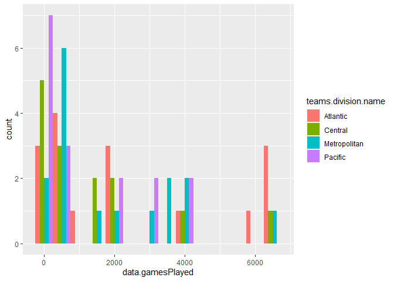

ST558 Project 1
================
Mu-Tien, Lee
2020,09.04

-   [Require Package](#require-package)
-   [Data cleaning](#data-cleaning)
    -   [Building functions to reach statsAPI](#building-functions-to-reach-statsapi)
    -   [Building functions to reach recordAPI](#building-functions-to-reach-recordapi)
    -   [accessory for API endpoints](#accessory-for-api-endpoints)
-   [Data analysis](#data-analysis)
-   [render("Project1.Rmd", output\_format ="github\_document", output\_file=I("README.md"))](#renderproject1.rmd-output_format-github_document-output_fileireadme.md)

Require Package
---------------

``` r
#install.packages("qwraps2")
library(rmarkdown)
library(dplyr)
library(tidyverse)
library(RSQLite)
library(bigrquery)
library(httr)
library(jsonlite)
library(ggplot2)
library(qwraps2)
```

Data cleaning
-------------

### Building functions to reach statsAPI

``` r
statsAPI <- function(x,teamid=NULL,year=NULL, ...){
#setting up base url for stats API
base_url <-"https://statsapi.web.nhl.com/api/v1/teams"
modifiers <- x

#construct the full path
if (is.null(teamid)){
full_url <- paste0(base_url, "?", modifiers)
}
else {
  full_url <- paste0(base_url, "/", teamid, "?", modifiers)
  } 

# retrieve information in raw form
GET(full_url)
#transfer into JSON text form
text <- content(GET(full_url),"text")
#convert it to a list
mydata <- fromJSON(text, flatten = TRUE) 
mydata<- as.data.frame(mydata)
return(mydata)
}

m<- statsAPI("expand=team.roster")
n<- statsAPI("expand=person.names")
o<- statsAPI("expand=team.schedule.next")
p<- statsAPI("expand=team.schedule.previous")
q<- statsAPI("expand=team.stats")
r<- statsAPI("expand=team.roster&season=20142015")
s<- statsAPI("teamId=4,5,29")
t<- statsAPI("stats=statsSingleSeasonPlayoffs")
```

### Building functions to reach recordAPI

``` r
recordAPI <- function(x,teamid=NULL,...){
#setting up base url for stats API
base_url <-"https://records.nhl.com/site/api"
modifiers <- x

if (is.null(teamid)){
    full_url <- paste0(base_url, "/", modifiers)
  }
else if (x %in% c("franchise","franchise-team-totals")) {
    stop("Sorry,table franchise and franchise-team-totals cannot indicate team")
  }
else {
  full_url <- paste0(base_url, "/", modifiers,"?cayenneExp=franchiseId=", teamid)
  } 

# retrieve information in raw form
GET(full_url)
#transfer into JSON text form
text <- content(GET(full_url),"text")
#convert it to a list
mydata <- fromJSON(text, flatten = TRUE) 
mydata<- as.data.frame(mydata)
return(mydata)
}

a<-recordAPI("franchise")
b<-recordAPI("franchise-team-totals")
c<-recordAPI("franchise-season-records",1)
d<-recordAPI("franchise-goalie-records",1)
e<-recordAPI("franchise-skater-records",1)
```

### accessory for API endpoints

``` r
endpoints <- function(x, teamid=NULL, year=NULL, ...){
  record <- c("franchise","franchise-team-totals","franchise-season-records", "franchise-goalie-records", "franchise-skater-records")
  stats <- c()
  if (x %in% record) recordAPI(x,teamid,...)
  else if (x %in% stats) statsAPI(x, teamid)
  else stop("Please enter the correct name of your enpoints")
}
try<-endpoints("franchise-season-records",1)
```

Data analysis
-------------

``` r
montreal <-recordAPI("franchise-season-records",8)
tornonto <-recordAPI("franchise-season-records",10)
detroit <-recordAPI("franchise-season-records",17)
carolinas <-recordAPI("franchise-season-records",12)
seasonrecord <- rbind.data.frame(Motreal_Canadiens=montreal, Tornonto_MapleLeafs=tornonto, Detroit_RedWings=detroit, Carolinas_Hurricanes=carolinas)
seasonrecord
```

    ##                      data.id data.fewestGoals data.fewestGoalsAgainst
    ## Motreal_Canadiens         44               NA                      NA
    ## Tornonto_MapleLeafs        3              150                     177
    ## Detroit_RedWings           5              182                     188
    ## Carolinas_Hurricanes      17              145                     132
    ##                      data.fewestGoalsAgainstSeasons data.fewestGoalsSeasons
    ## Motreal_Canadiens                              <NA>                    <NA>
    ## Tornonto_MapleLeafs                    1970-71 (78)            1954-55 (70)
    ## Detroit_RedWings                       1997-98 (82)            1969-70 (76)
    ## Carolinas_Hurricanes                   1953-54 (70)            2019-20 (82)
    ##                      data.fewestLosses   data.fewestLossesSeasons data.fewestPoints
    ## Motreal_Canadiens                   NA                       <NA>                NA
    ## Tornonto_MapleLeafs                 17               1971-72 (78)                47
    ## Detroit_RedWings                    21 1992-93 (84), 2016-17 (82)                38
    ## Carolinas_Hurricanes                13 1950-51 (70), 1995-96 (82)                39
    ##                      data.fewestPointsSeasons data.fewestTies data.fewestTiesSeasons
    ## Motreal_Canadiens                        <NA>              NA                   <NA>
    ## Tornonto_MapleLeafs              1965-66 (70)               4           2001-02 (82)
    ## Detroit_RedWings                 1983-84 (80)               4           1995-96 (82)
    ## Carolinas_Hurricanes             2019-20 (82)               4           1966-67 (70)
    ##                      data.fewestWins                   data.fewestWinsSeasons
    ## Motreal_Canadiens                 NA                                     <NA>
    ## Tornonto_MapleLeafs               17 1952-53 (70), 1954-55 (70), 1959-60 (70)
    ## Detroit_RedWings                  16                             1983-84 (80)
    ## Carolinas_Hurricanes              16                             1976-77 (80)
    ##                      data.franchiseId  data.franchiseName data.homeLossStreak
    ## Motreal_Canadiens                   8  Brooklyn Americans                   7
    ## Tornonto_MapleLeafs                10    New York Rangers                   7
    ## Detroit_RedWings                   17 Pittsburgh Penguins                  14
    ## Carolinas_Hurricanes               12   Detroit Red Wings                   7
    ##                                                  data.homeLossStreakDates
    ## Motreal_Canadiens                               Nov 23 1933 - Dec 26 1933
    ## Tornonto_MapleLeafs  Oct 20 1976 - Nov 14 1976, Mar 24 1993 - Apr 14 1993
    ## Detroit_RedWings                                Dec 31 2003 - Feb 22 2004
    ## Carolinas_Hurricanes                            Feb 20 1982 - Mar 25 1982
    ##                      data.homePointStreak
    ## Motreal_Canadiens                       9
    ## Tornonto_MapleLeafs                    24
    ## Detroit_RedWings                       20
    ## Carolinas_Hurricanes                   24
    ##                                                 data.homePointStreakDates
    ## Motreal_Canadiens                               Dec 13 1938 - Jan 24 1939
    ## Tornonto_MapleLeafs  Oct 14 1970 - Jan 31 1971, Oct 24 1995 - Feb 15 1996
    ## Detroit_RedWings                                Nov 30 1974 - Feb 22 1975
    ## Carolinas_Hurricanes                            Nov 05 2011 - Feb 23 2012
    ##                      data.homeWinStreak
    ## Motreal_Canadiens                     5
    ## Tornonto_MapleLeafs                  14
    ## Detroit_RedWings                     13
    ## Carolinas_Hurricanes                 23
    ##                                                                              data.homeWinStreakDates
    ## Motreal_Canadiens    Dec 20 1926 - Jan 04 1927, Nov 22 1928 - Dec 18 1928, Dec 13 1938 - Jan 01 1939
    ## Tornonto_MapleLeafs                                                        Dec 19 1939 - Feb 25 1940
    ## Detroit_RedWings                                                           Nov 15 2013 - Jan 15 2014
    ## Carolinas_Hurricanes                                                       Nov 05 2011 - Feb 19 2012
    ##                      data.homeWinlessStreak data.homeWinlessStreakDates
    ## Motreal_Canadiens                        11   Jan 07 1926 - Feb 18 1926
    ## Tornonto_MapleLeafs                      10   Jan 30 1944 - Mar 19 1944
    ## Detroit_RedWings                         16   Dec 31 2003 - Mar 04 2004
    ## Carolinas_Hurricanes                     10   Dec 11 1985 - Jan 18 1986
    ##                      data.lossStreak      data.lossStreakDates data.mostGameGoals
    ## Motreal_Canadiens                 10 Nov 22 1941 - Dec 16 1941                  9
    ## Tornonto_MapleLeafs               11 Oct 30 1943 - Nov 27 1943                 12
    ## Detroit_RedWings                  13 Jan 13 2004 - Feb 12 2004                 12
    ## Carolinas_Hurricanes              14 Feb 24 1982 - Mar 25 1982                 15
    ##                                                         data.mostGameGoalsDates
    ## Motreal_Canadiens                                   Mar 18 1937 - CHI 4 @ NYA 9
    ## Tornonto_MapleLeafs                                Nov 21 1971 - CGS 1 @ NYR 12
    ## Detroit_RedWings     Mar 15 1975 - WSH 1 @ PIT 12, Dec 26 1991 - TOR 1 @ PIT 12
    ## Carolinas_Hurricanes                               Jan 23 1944 - NYR 0 @ DET 15
    ##                      data.mostGoals data.mostGoalsAgainst data.mostGoalsAgainstSeasons
    ## Motreal_Canadiens               133                   186                 1940-41 (48)
    ## Tornonto_MapleLeafs             321                   345                 1984-85 (80)
    ## Detroit_RedWings                367                   394                 1982-83 (80)
    ## Carolinas_Hurricanes            369                   415                 1985-86 (80)
    ##                      data.mostGoalsSeasons data.mostLosses
    ## Motreal_Canadiens             1941-42 (48)              29
    ## Tornonto_MapleLeafs           1991-92 (80)              44
    ## Detroit_RedWings              1992-93 (84)              58
    ## Carolinas_Hurricanes          1992-93 (84)              57
    ##                                                      data.mostLossesSeasons
    ## Motreal_Canadiens    1936-37 (48), 1939-40 (48), 1940-41 (48), 1941-42 (48)
    ## Tornonto_MapleLeafs                                            1984-85 (80)
    ## Detroit_RedWings                                               1983-84 (80)
    ## Carolinas_Hurricanes                                           1985-86 (80)
    ##                      data.mostPenaltyMinutes data.mostPenaltyMinutesSeasons
    ## Motreal_Canadiens                        610                   1927-28 (44)
    ## Tornonto_MapleLeafs                     2021                   1989-90 (80)
    ## Detroit_RedWings                        2674                   1988-89 (80)
    ## Carolinas_Hurricanes                    2391                   1987-88 (80)
    ##                      data.mostPoints data.mostPointsSeasons data.mostShutouts
    ## Motreal_Canadiens                 50           1928-29 (44)                16
    ## Tornonto_MapleLeafs              113           2014-15 (82)                13
    ## Detroit_RedWings                 119           1992-93 (84)                10
    ## Carolinas_Hurricanes             131           1995-96 (82)                13
    ##                      data.mostShutoutsSeasons data.mostTies
    ## Motreal_Canadiens                1928-29 (44)            12
    ## Tornonto_MapleLeafs              1928-29 (44)            21
    ## Detroit_RedWings                 2014-15 (82)            20
    ## Carolinas_Hurricanes             1953-54 (70)            18
    ##                                          data.mostTiesSeasons data.mostWins
    ## Motreal_Canadiens                                1928-29 (44)            19
    ## Tornonto_MapleLeafs                              1950-51 (70)            53
    ## Detroit_RedWings                                 1970-71 (78)            56
    ## Carolinas_Hurricanes 1952-53 (70), 1980-81 (80), 1996-97 (82)            62
    ##                            data.mostWinsSeasons data.pointStreak
    ## Motreal_Canadiens    1928-29 (44), 1937-38 (48)                8
    ## Tornonto_MapleLeafs                2014-15 (82)               19
    ## Detroit_RedWings                   1992-93 (84)               18
    ## Carolinas_Hurricanes               1995-96 (82)               20
    ##                          data.pointStreakDates data.roadLossStreak
    ## Motreal_Canadiens    Jan 01 1933 - Jan 17 1933                  10
    ## Tornonto_MapleLeafs  Nov 23 1939 - Jan 13 1940                  10
    ## Detroit_RedWings     Mar 09 1993 - Apr 14 1993                  18
    ## Carolinas_Hurricanes Mar 09 2006 - Apr 17 2006                  14
    ##                                                  data.roadLossStreakDates
    ## Motreal_Canadiens                               Nov 16 1929 - Jan 04 1930
    ## Tornonto_MapleLeafs  Oct 30 1943 - Dec 23 1943, Feb 08 1961 - Mar 15 1961
    ## Detroit_RedWings                                Dec 23 1982 - Mar 04 1983
    ## Carolinas_Hurricanes                            Oct 19 1966 - Dec 21 1966
    ##                      data.roadPointStreak
    ## Motreal_Canadiens                       5
    ## Tornonto_MapleLeafs                    11
    ## Detroit_RedWings                        8
    ## Carolinas_Hurricanes                   15
    ##                                                                            data.roadPointStreakDates
    ## Motreal_Canadiens    Dec 25 1928 - Jan 27 1929, Nov 12 1931 - Dec 08 1931, Dec 12 1933 - Jan 13 1934
    ## Tornonto_MapleLeafs                                                        Nov 05 1939 - Jan 13 1940
    ## Detroit_RedWings                                Jan 13 2007 - Feb 16 2007, Mar 11 2016 - Apr 07 2016
    ## Carolinas_Hurricanes                                                       Oct 18 1951 - Dec 20 1951
    ##                      data.roadWinStreak
    ## Motreal_Canadiens                     3
    ## Tornonto_MapleLeafs                   9
    ## Detroit_RedWings                      8
    ## Carolinas_Hurricanes                 12
    ##                                                   data.roadWinStreakDates
    ## Motreal_Canadiens    Feb 19 1926 - Mar 02 1926, Dec 19 1937 - Jan 01 1938
    ## Tornonto_MapleLeafs                             Jan 16 2020 - Feb 27 2020
    ## Detroit_RedWings                                Mar 11 2016 - Apr 07 2016
    ## Carolinas_Hurricanes                            Mar 01 2006 - Apr 15 2006
    ##                      data.roadWinlessStreak
    ## Motreal_Canadiens                        22
    ## Tornonto_MapleLeafs                      16
    ## Detroit_RedWings                         18
    ## Carolinas_Hurricanes                     26
    ##                                               data.roadWinlessStreakDates
    ## Motreal_Canadiens                               Nov 19 1940 - Mar 16 1941
    ## Tornonto_MapleLeafs                             Oct 09 1952 - Dec 20 1952
    ## Detroit_RedWings     Oct 25 1970 - Jan 14 1971, Dec 23 1982 - Mar 04 1983
    ## Carolinas_Hurricanes                            Dec 15 1976 - Apr 03 1977
    ##                      data.winStreak
    ## Motreal_Canadiens                 5
    ## Tornonto_MapleLeafs              10
    ## Detroit_RedWings                 17
    ## Carolinas_Hurricanes              9
    ##                                                                                                                                                                                              data.winStreakDates
    ## Motreal_Canadiens                                                                                                                                                                      Dec 09 1928 - Dec 18 1928
    ## Tornonto_MapleLeafs                                                                                                                                         Dec 19 1939 - Jan 13 1940, Jan 19 1973 - Feb 10 1973
    ## Detroit_RedWings                                                                                                                                                                       Mar 09 1993 - Apr 10 1993
    ## Carolinas_Hurricanes Mar 03 1951 - Mar 21 1951, Feb 27 1955 - Mar 20 1955, Dec 12 1995 - Dec 31 1995, Mar 03 1996 - Mar 22 1996, Oct 13 2005 - Nov 01 2005, Oct 25 2006 - Nov 14 2006, Oct 18 2007 - Nov 09 2007
    ##                      data.winlessStreak   data.winlessStreakDates total
    ## Motreal_Canadiens                    NA                      <NA>     1
    ## Tornonto_MapleLeafs                   5 Oct 12 2019 - Oct 22 2019     1
    ## Detroit_RedWings                      6 Feb 20 2020 - Feb 29 2020     1
    ## Carolinas_Hurricanes                 12 Nov 14 2019 - Dec 10 2019     1

``` r
montreal <-recordAPI("franchise-goalie-records",8)
tornonto <-recordAPI("franchise-goalie-records",10)
detroit <-recordAPI("franchise-goalie-records",17)
carolinas <-recordAPI("franchise-goalie-records",12)
goalierecord <- rbind.data.frame(Motreal_Canadiens=montreal, Tornonto_MapleLeafs=tornonto, Detroit_RedWings=detroit, Carolinas_Hurricanes=carolinas)

montreal <-recordAPI("franchise-skater-records",8)
tornonto <-recordAPI("franchise-skater-records",10)
detroit <-recordAPI("franchise-skater-records",17)
carolinas <-recordAPI("franchise-skater-records",12)
skaterrecord <- rbind.data.frame(Motreal_Canadiens=montreal, Tornonto_MapleLeafs=tornonto, Detroit_RedWings=detroit, Carolinas_Hurricanes=carolinas)

mydata <- statsAPI("teamId=8,10,17,12")


bar1 <- ggplot(data=new,aes(x=data.gamesPlayed))
bar1+geom_histogram(aes(fill=teams.division.name),binwidth = 500, position= "dodge")
```



``` r
teamtotal<-recordAPI("franchise-team-totals")%>% filter(is.na(data.lastSeasonId))
division <- statsAPI("expand=team.roster")%>% select(teams.id, teams.division.name, teams.division.nameShort, teams.conference.name) %>%rename(data.teamId=teams.id)

new <- left_join(teamtotal,division, by="data.teamId") %>% mutate(winrate=data.wins/data.gamesPlayed, winlossrate=data.wins/data.losses, overtimelossrate= data.overtimeLosses/data.losses, goalpergame=data.goalsFor/data.gamesPlayed)

for (i in 1: nrow(new)){
  if (new$data.firstSeasonId[i]/10000<1943){
    new$age[i]<- "Senior"
  }
  else if (new$data.firstSeasonId[i]/10000<1968){
    new$age[i]<- "Junior"
  }
  else if (new$data.firstSeasonId[i]/10000<1993){
    new$age[i]<- "Sophomore"
  }
  else {
    new$age[i]<- "Freshman"
  }
}
```

``` r
levels(new$age)<-list("1917-1942"="Freshman","1942-1967"="Sophomore","1967-1992"="Junior","1992-2017"="Senior")
table1 <- table(new$teams.division.name,new$age)
table1 
```

    ##               
    ##                Freshman Junior Senior Sophomore
    ##   Atlantic            2      0      8         6
    ##   Central            10      2      2         0
    ##   Metropolitan        4      4      2         6
    ##   Pacific             6      2      0         8

``` r
type2 <- new %>% filter(data.gameTypeId==2)
type3 <- new %>% filter(data.gameTypeId==3)
histo1 <- ggplot(data=type2,aes(x=data.penaltyMinutes))
histo1+geom_histogram(binwidth = 10000)
```


``` r
histo2 <- ggplot(data=type3,aes(x=data.penaltyMinutes))
histo2+geom_histogram(binwidth = 800)
```


``` r
calculate <- function(x,...){
  data <- new %>% filter(data.gameTypeId == x)%>% select(winrate,winlossrate,overtimelossrate,goalpergame)
    kable(apply(data,2, summary), digit = 4,caption = paste0("Summary of gametpye", x))
}
calculate(2)
```

|         |  winrate|  winlossrate|  overtimelossrate|  goalpergame|
|:--------|--------:|------------:|-----------------:|------------:|
| Min.    |   0.3958|       0.8051|            0.0546|       2.4833|
| 1st Qu. |   0.4413|       1.0471|            0.0890|       2.8356|
| Median  |   0.4605|       1.1643|            0.1252|       3.0541|
| Mean    |   0.4639|       1.1710|            0.1508|       2.9862|
| 3rd Qu. |   0.4837|       1.2694|            0.2157|       3.1771|
| Max.    |   0.5660|       1.6625|            0.2750|       3.3322|

``` r
calculate(3)
```

|         |  winrate|  winlossrate|  overtimelossrate|  goalpergame|
|:--------|--------:|------------:|-----------------:|------------:|
| Min.    |   0.3506|       0.5400|            0.0000|       2.2597|
| 1st Qu. |   0.4536|       0.8321|            0.0000|       2.5917|
| Median  |   0.4891|       0.9745|            0.0000|       2.7400|
| Mean    |   0.4906|       0.9962|            0.0007|       2.7762|
| 3rd Qu. |   0.5354|       1.1523|            0.0000|       2.9395|
| Max.    |   0.5970|       1.4815|            0.0111|       3.6791|

``` r
 #if(x==2) caption="summary of regular season" else caption="summary of playoff season"
#caption = paste0("Summary of gametpyre", x)
```

render("Project1.Rmd", output\_format ="github\_document", output\_file=I("README.md"))
=======================================================================================
