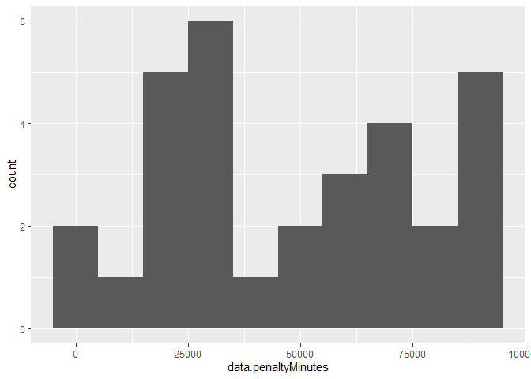
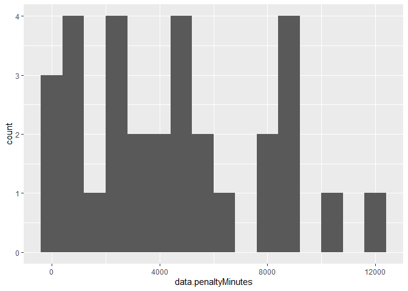

ST558 Project 1
================
Mu-Tien, Lee
2020,09.04

-   [Require Package](#require-package)
-   [Discription](#discription)
-   [Data cleaning](#data-cleaning)
    -   [Building functions to reach statsAPI](#building-functions-to-reach-statsapi)
    -   [Building functions to reach recordAPI](#building-functions-to-reach-recordapi)
    -   [Accessory for API endpoints](#accessory-for-api-endpoints)
-   [Data analysis](#data-analysis)
    -   [Building data for later use](#building-data-for-later-use)
    -   [Numeric summarize](#numeric-summarize)
        -   [A contingency table (Division\*Fist year of play)](#a-contingency-table-divisionfist-year-of-play)
        -   [Numeric summary table](#numeric-summary-table)
    -   [Plots](#plots)
        -   [A bar plot tells conference and division](#a-bar-plot-tells-conference-and-division)
        -   [Histogram of penalty times](#histogram-of-penalty-times)
-   [Data analysis between 4 selected team](#data-analysis-between-4-selected-team)
    -   [Arrange data for later use](#arrange-data-for-later-use)
    -   [Numerical summary](#numerical-summary)
        -   [Some data to compare between these team](#some-data-to-compare-between-these-team)
        -   [Distribution of skater position for each team](#distribution-of-skater-position-for-each-team)
    -   [Plots](#plots-1)
        -   [Scatter and boxplot](#scatter-and-boxplot)
-   [The End](#the-end)

Require Package
===============

``` r
#install.packages("qwraps2")
library(rmarkdown)
library(dplyr)
library(tidyverse)
library(knitr)
library(RSQLite)
library(bigrquery)
library(httr)
library(jsonlite)
library(ggplot2)
library(qwraps2)
```

Discription
===========

This project are going to talk about some data in NHL the franchise are loaded from <https://gitlab.com/dword4/nhlapi/-/blob/master/records-api.md> and <https://gitlab.com/dword4/nhlapi/-/blob/master/stats-api.md>. You may use `endpoint` function and key in with correct endpoint's name to get whatever table you would like to get. At some point you can assign a specific team by both name and team ID/franchise ID. After that I will show you some data analysis among all active team and some selected team. wish you can have some fun in this project!

Data cleaning
=============

Building functions to reach statsAPI
------------------------------------

``` r
#build up base dataset for switch team.names and team.ID
text <- content(GET("https://statsapi.web.nhl.com/api/v1/teams?expand=team.roster"),"text")
base <- fromJSON(text, flatten = TRUE) 
base <- as.data.frame(base) %>% select(teams.franchise.teamName,teams.franchiseId,teams.teamName,teams.id)

#make a function to let user reach statsAPI
statsAPI <- function(x,teamID=NULL,season=NULL, ...){
  
#setting up base url for stats API
base_url <-"https://statsapi.web.nhl.com/api/v1/teams"
modifiers <- x

#construct the full path
if (x %in% "teamId"){
  full_url <- paste0(base_url, "?", modifiers, "=", teamID)
}
#convert team name into teamID
else if(is.character(teamID)){
  base <- base %>% filter(teams.teamName==teamID)
  teamID <- base[4]
}

if (x %in% c("expand=team.roster","expand=person.names","expand=team.schedule.next","expand=team.schedule.previous","expand=team.stats","stats=statsSingleSeasonPlayoffs")){
  
  if (is.null(teamID)){
    full_url <- paste0(base_url, "?", modifiers)}
  
  else {
    full_url <- paste0(base_url, "/", teamID, "?", modifiers)}
}  
  
else if (x %in% "expand=team.roster&season" ){
  if (is.null(season)){
    stop("seaon is missing")}
  
  else if(length(teamID)>1){
    stop("sorry, we can only show one team each time")}
  
  else if(is.null(teamID)){
    full_url <- paste0(base_url,"?", modifiers,"=", 20142015)}

  else {
    full_url <- paste0(base_url, "/", teamID, "?", modifiers,"=", season)}
}

# retrieve information in raw form
GET(full_url)
#transfer into JSON text form
text <- content(GET(full_url),"text")
#convert it to a list
mydata <- fromJSON(text, flatten = TRUE) 
mydata<- as.data.frame(mydata)
return(mydata)
}
```

Building functions to reach recordAPI
-------------------------------------

``` r
#make a function to let user reach record API
recordAPI <- function(x,franchiseID=NULL,...){
#setting up base url for stats API
base_url <-"https://records.nhl.com/site/api"
modifiers <- x

#convert team name into teamID
if(is.character(franchiseID)){
  base <- base %>% filter(teams.franchise.teamName==franchiseID)
  franchiseID <- base[2]
  franchiseID
}

#construct the full url path
if (is.null(franchiseID)){
    full_url <- paste0(base_url, "/", modifiers)
  }
else if (x %in% c("franchise","franchise-team-totals")) {
    stop("Sorry,table franchise and franchise-team-totals cannot indicate team")
  }
else {
  full_url <- paste0(base_url, "/", modifiers,"?cayenneExp=franchiseId=", franchiseID)
  } 

#retrieve information in raw form
GET(full_url)
#transfer into JSON text form
text <- content(GET(full_url),"text")
#convert it to a list
mydata <- fromJSON(text, flatten = TRUE) 
mydata<- as.data.frame(mydata)
return(mydata)
}
```

Below is a function that can help you read whatever the endpoint you would like to get, please key in the following option in the function. NOTE: If you want to reach out to the **teamId** please put your teamID as character, ex:`"2,12,22"` to reach the table.

``` r
endpoints <- c("franchise","franchise-team-totals","franchise-season-records","franchise-goalie-records","franchise-skater-records","expand=team.roster","expand=person.names","expand=team.schedule.next","expand=team.schedule.previous","expand=team.stats","expand=team.roster&season","teamId","stats=statsSingleSeasonPlayoffs")

idOption <- c(rep("None",2),rep("franchiseID or teamName without location",3),rep("teamID or teamName without location",8))

seasonOption <- c(rep("No",10),"Yes", "No","No")

kable(cbind(endpoints,idOption,seasonOption))
```

| endpoints                       | idOption                                 | seasonOption |
|:--------------------------------|:-----------------------------------------|:-------------|
| franchise                       | None                                     | No           |
| franchise-team-totals           | None                                     | No           |
| franchise-season-records        | franchiseID or teamName without location | No           |
| franchise-goalie-records        | franchiseID or teamName without location | No           |
| franchise-skater-records        | franchiseID or teamName without location | No           |
| expand=team.roster              | teamID or teamName without location      | No           |
| expand=person.names             | teamID or teamName without location      | No           |
| expand=team.schedule.next       | teamID or teamName without location      | No           |
| expand=team.schedule.previous   | teamID or teamName without location      | No           |
| expand=team.stats               | teamID or teamName without location      | No           |
| expand=team.roster&season       | teamID or teamName without location      | Yes          |
| teamId                          | teamID or teamName without location      | No           |
| stats=statsSingleSeasonPlayoffs | teamID or teamName without location      | No           |

``` r
kable(base, caption = "ID table for teams")
```

| teams.franchise.teamName |  teams.franchiseId| teams.teamName |  teams.id|
|:-------------------------|------------------:|:---------------|---------:|
| Devils                   |                 23| Devils         |         1|
| Islanders                |                 22| Islanders      |         2|
| Rangers                  |                 10| Rangers        |         3|
| Flyers                   |                 16| Flyers         |         4|
| Penguins                 |                 17| Penguins       |         5|
| Bruins                   |                  6| Bruins         |         6|
| Sabres                   |                 19| Sabres         |         7|
| Canadiens                |                  1| Canadiens      |         8|
| Senators                 |                 30| Senators       |         9|
| Maple Leafs              |                  5| Maple Leafs    |        10|
| Hurricanes               |                 26| Hurricanes     |        12|
| Panthers                 |                 33| Panthers       |        13|
| Lightning                |                 31| Lightning      |        14|
| Capitals                 |                 24| Capitals       |        15|
| Blackhawks               |                 11| Blackhawks     |        16|
| Red Wings                |                 12| Red Wings      |        17|
| Predators                |                 34| Predators      |        18|
| Blues                    |                 18| Blues          |        19|
| Flames                   |                 21| Flames         |        20|
| Avalanche                |                 27| Avalanche      |        21|
| Oilers                   |                 25| Oilers         |        22|
| Canucks                  |                 20| Canucks        |        23|
| Ducks                    |                 32| Ducks          |        24|
| Stars                    |                 15| Stars          |        25|
| Kings                    |                 14| Kings          |        26|
| Sharks                   |                 29| Sharks         |        28|
| Blue Jackets             |                 36| Blue Jackets   |        29|
| Wild                     |                 37| Wild           |        30|
| Jets                     |                 35| Jets           |        52|
| Coyotes                  |                 28| Coyotes        |        53|
| Golden Knights           |                 38| Golden Knights |        54|

Accessory for API endpoints
---------------------------

``` r
#build a wrapper function to let user reach endpoints easily
endpoints <- function(x,...){
  record <- c("franchise","franchise-team-totals","franchise-season-records", "franchise-goalie-records", "franchise-skater-records")
  
  stats <- c("expand=team.roster","expand=person.names","expand=team.schedule.next","expand=team.schedule.previous","expand=team.stats","expand=team.roster&season","teamId","stats=statsSingleSeasonPlayoffs")
  
  if (x %in% record) recordAPI(x,...)
  else if (x %in% stats) statsAPI(x,...)
  else stop("Please enter the correct name of your enpoints")
}
```

Data analysis
=============

Building data for later use
---------------------------

``` r
#get some wins/losses data for active teams
teamtotal<-endpoints("franchise-team-totals")%>% filter(is.na(data.lastSeasonId))

#get teams' division and conference from another table
division <- endpoints("expand=team.roster")%>% select(teams.id, teams.division.name, teams.division.nameShort, teams.conference.name) %>%rename(data.teamId=teams.id)

#combine them as new dataset
new <- left_join(teamtotal,division, by="data.teamId") 

#creat new variables
#calculating some rate
new <- new %>% mutate(winrate=data.wins/data.gamesPlayed, winlossrate=data.wins/data.losses, overtimelossrate= data.overtimeLosses/data.losses, goalpergame=data.goalsFor/data.gamesPlayed, averagePenaltytime= data.penaltyMinutes/data.gamesPlayed)%>% mutate(lossathomerate=data.homeLosses/(data.homeLosses+data.homeWins),winonraodrate=data.roadWins/(data.roadWins+data.roadLosses))

#put the level on the age of teams
for (i in 1: nrow(new)){
  
  if (new$data.firstSeasonId[i]/10000<1943){
    new$age[i]<- "Senior"
  }
  else if (new$data.firstSeasonId[i]/10000<1968){
    new$age[i]<- "Junior"
  }
  else if (new$data.firstSeasonId[i]/10000<1993){
    new$age[i]<- "Sophomore"
  }
  else {
    new$age[i]<- "Freshman"
  }
}
```

Numeric summarize
-----------------

### A contingency table (Division\*Fist year of play)

``` r
#level the age
new$age <- as.factor(new$age)
levels(new$age)<-list("1917-1942"="Senior","1942-1967"="Junior","1967-1992"="Sophomore","1992-2017"="Freshman")

#show the table
datafortable <- new %>% filter(data.gameTypeId==2)
table1 <- table(datafortable$age, datafortable$teams.division.name) 
kable(table1,caption = " Division and Team established year information") 
```

|           |  Atlantic|  Central|  Metropolitan|  Pacific|
|:----------|---------:|--------:|-------------:|--------:|
| 1917-1942 |         4|        1|             1|        0|
| 1942-1967 |         0|        1|             2|        1|
| 1967-1992 |         3|        0|             3|        4|
| 1992-2017 |         1|        5|             2|        3|

In this table, we can notice that Atlantic has older team distribution when Centrl and Pacific have more younger team

### Numeric summary table

``` r
#make a summary table among all teams

#build a function for calculation
calculate <- function(x,...){
  data <- new %>% filter(data.gameTypeId == x)%>% select(winrate,winlossrate,overtimelossrate,goalpergame)
  if (x==2) type <- "regular season" else type <- "play off season"

kable(apply(data,2, summary), digit = 4,caption = paste0("Summary among all active teams during ", type))
}
calculate(2)
```

|         |  winrate|  winlossrate|  overtimelossrate|  goalpergame|
|:--------|--------:|------------:|-----------------:|------------:|
| Min.    |   0.3958|       0.8051|            0.0546|       2.4833|
| 1st Qu. |   0.4413|       1.0471|            0.0890|       2.8356|
| Median  |   0.4605|       1.1643|            0.1252|       3.0541|
| Mean    |   0.4639|       1.1710|            0.1508|       2.9862|
| 3rd Qu. |   0.4837|       1.2694|            0.2157|       3.1771|
| Max.    |   0.5660|       1.6625|            0.2750|       3.3322|

``` r
calculate(3)
```

|         |  winrate|  winlossrate|  overtimelossrate|  goalpergame|
|:--------|--------:|------------:|-----------------:|------------:|
| Min.    |   0.3506|       0.5400|            0.0000|       2.2597|
| 1st Qu. |   0.4536|       0.8321|            0.0000|       2.5917|
| Median  |   0.4891|       0.9745|            0.0000|       2.7400|
| Mean    |   0.4906|       0.9964|            0.0007|       2.7758|
| 3rd Qu. |   0.5354|       1.1523|            0.0000|       2.9395|
| Max.    |   0.5970|       1.4815|            0.0111|       3.6791|

In this two table we can see that the win rate and goal per game have no huge difference between regular season and play off season. However, the over time loss rate is very differet. Also, we can discover that the mean is higher that 755 percentile which meas that only a small group of team have over time loss in play off season.

``` r
#make a summary with grouping data by division
catesummary <- function(x,...){
  datacatesumm <- new %>% filter(data.gameTypeId == 2)%>% filter(teams.division.name == x) %>% select(data.goalsAgainst,data.goalsFor, data.points, data.pointPctg, data.wins)
    kable(apply(datacatesumm,2, summary), caption = paste("Summary of division", x), digit = 4, col.names = c("Goal Against", "Goals For", "Points", "Point Percentage", " Wins"))
}
catesummary("Metropolitan")
```

|         |  Goal Against|  Goals For|   Points|  Point Percentage|     Wins|
|:--------|-------------:|----------:|--------:|-----------------:|--------:|
| Min.    |       4425.00|    3955.00|  1500.00|            0.4960|   660.00|
| 1st Qu. |       7782.00|    7669.00|  2806.75|            0.5122|  1229.00|
| Median  |      11584.50|   11607.00|  3803.50|            0.5201|  1660.00|
| Mean    |      10889.50|   10952.50|  3717.75|            0.5248|  1615.25|
| 3rd Qu. |      12513.75|   13564.75|  4382.25|            0.5304|  1913.00|
| Max.    |      19863.00|   19864.00|  6667.00|            0.5759|  2856.00|

``` r
catesummary("Atlantic")
```

|         |  Goal Against|  Goals For|   Points|  Point Percentage|     Wins|
|:--------|-------------:|----------:|--------:|-----------------:|--------:|
| Min.    |       5969.00|    5476.00|  2049.00|            0.4990|   852.00|
| 1st Qu. |       6471.75|    6078.50|  2170.50|            0.5074|   948.75|
| Median  |      14929.50|   15878.00|  5382.50|            0.5228|  2314.00|
| Mean    |      13279.12|   13966.12|  4890.75|            0.5304|  2113.25|
| 3rd Qu. |      18782.75|   20080.75|  6865.25|            0.5429|  2956.00|
| Max.    |      19805.00|   21632.00|  7899.00|            0.5868|  3449.00|

``` r
catesummary("Central")
```

|         |  Goal Against|  Goals For|    Points|  Point Percentage|      Wins|
|:--------|-------------:|----------:|---------:|-----------------:|---------:|
| Min.    |      1997.000|   2039.000|   776.000|            0.5040|   352.000|
| 1st Qu. |      4264.500|   4279.500|  1757.500|            0.5401|   772.500|
| Median  |      5325.000|   5660.000|  2175.000|            0.5561|   968.000|
| Mean    |      7617.857|   7736.571|  2830.143|            0.5499|  1230.857|
| 3rd Qu. |      8986.500|   9261.000|  3394.500|            0.5628|  1481.500|
| Max.    |     19501.000|  19376.000|  6556.000|            0.5833|  2788.000|

``` r
catesummary("Pacific")
```

|         |  Goal Against|  Goals For|   Points|  Point Percentage|      Wins|
|:--------|-------------:|----------:|--------:|-----------------:|---------:|
| Min.    |       669.000|    748.000|   288.00|            0.4521|   133.000|
| 1st Qu. |      4605.000|   4473.250|  1776.50|            0.4908|   777.250|
| Median  |      8039.500|   8220.000|  2835.00|            0.5268|  1241.500|
| Mean    |      7591.375|   7429.625|  2477.75|            0.5227|  1076.125|
| 3rd Qu. |     11062.000|  10941.500|  3469.50|            0.5414|  1509.750|
| Max.    |     13591.000|  12910.000|  4048.00|            0.6128|  1733.000|

In these table we can notice that Atlantic is tha division that has the most win among all division, this is very reasonable for me because in the previous table, we know that Atlantic is the one that has more older teams. Other data seems reasonable, in goals Against and Goals for the summary are similar among all the division, only Pacific and Central has lower minimum. Maybe some younger teams just played less games than others.

Plots
-----

### A bar plot tells conference and division

``` r
#draw a bar plot to show the count in each division and conference
type2 <- new %>% filter(data.gameTypeId==2)
bar1 <- ggplot(data=type2,aes(x=teams.conference.name))
bar1+ geom_bar(aes(fill=teams.division.name), position = "dodge")+labs(title = "Barplot for teams' Conference and Division")+xlab("Conference")
```

 This Bar plot show you the count of each Dicision and Conference. So we know that there are two conference, each has two division. In each division there are 7~8 teams.

### Histogram of penalty times

``` r
#seperate data by regular season and play off season since the differnce are obvious
type3 <- new %>% filter(data.gameTypeId==3)

#make two histogram to show the distribution of penalty time
histo1 <- ggplot(data=type2,aes(x=averagePenaltytime))
histo1+geom_histogram(binwidth = 1, aes(fill=age))+labs(title = "Histogram for penalty time during relugar season")+xlab("Average penalty time (in minutes)")
```



``` r
histo2 <- ggplot(data=type3,aes(x=averagePenaltytime))
histo2+geom_histogram(binwidth = 1, aes(fill=age))+labs(title = "Histogram for penalty time during play off season")+xlab("Average penalty time (in minutes)")
```



In these 2 plots we can say that the oldest teams have lower average penalty time both in the regular seasons and in the play off seasons if we don't take recent established teams into consider.

Data analysis between 4 selected team
=====================================

I choose NY islanders, Tampa Bay lightening, Vegas Golden Knights, Dallas stars, which are in the Conference Finals in 2019-20 NHL season.

Arrange data for later use
--------------------------

``` r
#filtering old dataset to only selected groups
fourteams <- filter(new, data.teamId %in% c(2, 14, 25, 54)) 
fourteams <- fourteams 

#making some new dataset on selected
#dataset of season record
NY <-endpoints("franchise-season-records",22)
Tampa_bay <-endpoints("franchise-season-records",31)
Vegas <-endpoints("franchise-season-records",38)
Dallas <-endpoints("franchise-season-records",15)
seasonrecord <- rbind.data.frame(NY, Tampa_bay, Vegas, Dallas)

#detail about the goalier of selected team
NY <-endpoints("franchise-goalie-records",22)
Tampa_bay <-endpoints("franchise-goalie-records",31)
Vegas <-endpoints("franchise-goalie-records",38)
Dallas <-endpoints("franchise-goalie-records",15)
goalierecord <- rbind.data.frame(NY, Tampa_bay, Vegas, Dallas)

#detail about the skater of selected team
NY <-endpoints("franchise-skater-records",22)
Tampa_bay <-endpoints("franchise-skater-records",31)
Vegas <-endpoints("franchise-skater-records",38)
Dallas <-endpoints("franchise-skater-records",15)
skaterrecord <- rbind.data.frame(NY, Tampa_bay, Vegas, Dallas)

#make one new variables for goalier
goalierecord <- goalierecord %>% mutate(winRate=data.wins/data.gamesPlayed)
```

Numerical summary
-----------------

### Some data to compare between these team

``` r
#rearrange the dataset
fourteams <- fourteams %>% select(data.teamName,data.gamesPlayed,winrate,winonraodrate,lossathomerate,data.gameTypeId)%>% arrange( data.gameTypeId)

rs <- filter(fourteams, data.gameTypeId==2) %>% select(-data.gameTypeId)
pos <- filter(fourteams, data.gameTypeId==3) %>% select(-data.gameTypeId)

#print it out
kable(rs, caption = "Data summary of selected team during regular season", col.names = c("Team", "Game Played", "Win Rate", "Win on Road Rate", "Loss at Home Rate"))
```

| Team                 |  Game Played|   Win Rate|  Win on Road Rate|  Loss at Home Rate|
|:---------------------|------------:|----------:|-----------------:|------------------:|
| New York Islanders   |         3732|  0.4437299|         0.4434783|          0.4170792|
| Tampa Bay Lightning  |         2138|  0.4438728|         0.4400428|          0.4306878|
| Dallas Stars         |         2053|  0.5168047|         0.5381166|          0.3457207|
| Vegas Golden Knights |          235|  0.5659574|         0.5523810|          0.3055556|

``` r
kable(pos, caption = "Data summary of selected team during play off season", col.names = c("Team", "Game Played", "Win Rate", "Win on Road Rate", "Loss at Home Rate"))
```

| Team                 |  Game Played|   Win Rate|  Win on Road Rate|  Loss at Home Rate|
|:---------------------|------------:|----------:|-----------------:|------------------:|
| New York Islanders   |          294|  0.5476190|         0.4610390|          0.3571429|
| Tampa Bay Lightning  |          156|  0.5576923|         0.5866667|          0.4691358|
| Dallas Stars         |          194|  0.5309278|         0.5051546|          0.4432990|
| Vegas Golden Knights |           47|  0.5957447|         0.5217391|          0.3333333|

These table show the data directly, we can notice that **Vegas Golden Knights** has not played many games. Because this team started to play in NHL in 2017. Therefore, the data seems to be not so compareable to other three groups. But we can also say that, this young group has less likely to loss at home than any others.

### Distribution of skater position for each team

``` r
#showing skater position distribution of selected between non-active player and avctive player
table2 <- table(skaterrecord$data.positionCode, skaterrecord$data.franchiseName, skaterrecord$data.activePlayer) 
kable(table2[ , ,1],caption = " Position distribution of skater for non-active player")
```

|     |  Dallas Stars|  New York Islanders|  Tampa Bay Lightning|  Vegas Golden Knights|
|:----|-------------:|-------------------:|--------------------:|---------------------:|
| C   |           135|                 120|                   59|                     1|
| D   |           179|                 159|                  126|                     1|
| L   |           124|                  98|                   63|                     1|
| R   |           114|                  78|                   67|                     1|

``` r
kable(table2[ , ,2],caption = " Position distribution of skater for active player")
```

|     |  Dallas Stars|  New York Islanders|  Tampa Bay Lightning|  Vegas Golden Knights|
|:----|-------------:|-------------------:|--------------------:|---------------------:|
| C   |            17|                  15|                   22|                    14|
| D   |            25|                  19|                   15|                    14|
| L   |            10|                  10|                    6|                    10|
| R   |            11|                  10|                    8|                     5|

The distribution of the position is similar among each team about 15 for position c and D and about 10 for L and R. **Vegaas golden Knights** has less amount in each position maybe because they are a 3-year-old team.

Plots
-----

### Scatter and boxplot

``` r
#choosing player that have already played over 10 games
actskaterrecord <- skaterrecord %>%  filter(data.gamesPlayed > 10)

#make a boxplot for skater to see the summary of most point in one season
boxplot1 <- ggplot(data=actskaterrecord,aes(x=data.franchiseName, y=data.mostPointsOneSeason))
boxplot1+geom_boxplot()+labs(title="Boxplot of most point in one season for skater who palyed more than 15 games", x="Team", y="Skater's Most Point in One Season")
```

 We can say that **Vegas Golden Knights** has higher average points in one season and **Tampa Bay Lightning** has a liitle bit lower. Also, there are some outliers for **New York Islanders** and **Tampa Bay Lightning**. I personnally think that this is Rare in a century. Many fter 50 years \*\* Vegas Golen Knights\*\* will also have some skaters who will get more than 100 points in one season.

``` r
#showing the win rate boxplot of the goalier of selected team
boxplot2 <- ggplot(data=goalierecord,aes(x=data.franchiseName, y=winRate))
boxplot2+geom_boxplot()+geom_jitter(aes(color=data.franchiseName))+labs(title="Boxplot of win rate for goalier", x="Team", y=" Goalier's win rate")
```


``` r
scatter1 <- ggplot(data=goalierecord, aes(x=data.mostGoalsAgainstOneGame, y=data.mostSavesOneGame))

scatter1+ geom_point(aes(color=data.activePlayer))+geom_smooth(aes(group=data.franchiseName), method=lm, color= "orange")+ labs(title = "Most saves vs Most goal against of goalier", x="Most Goal Against (in one game)", y="Most Saves (in one game)")+facet_grid(.~data.franchiseName)
```


In this plot we can notice that **Tampa Bay Lightning's** goalier are worse savers but better goal maker than other teams' goalier.

The End
=======

Thank you for reading my Prooject.

render("Project1.Rmd", output\_format ="github\_document", output\_file=I("README.md"))
